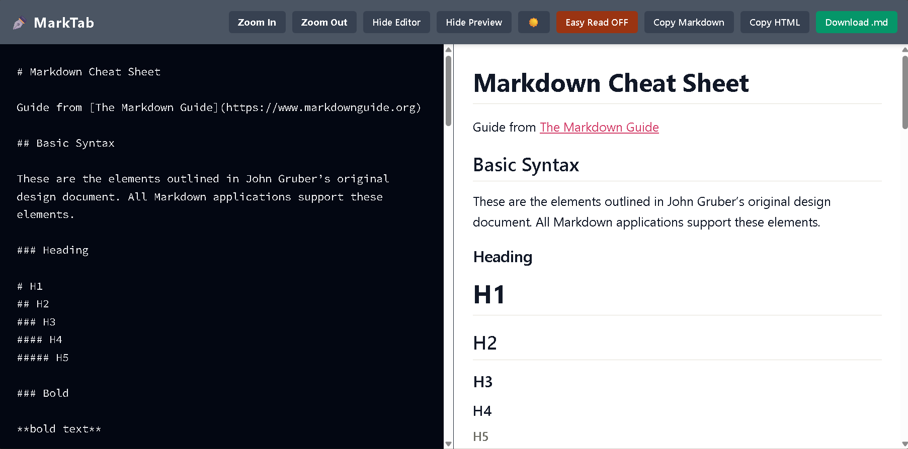
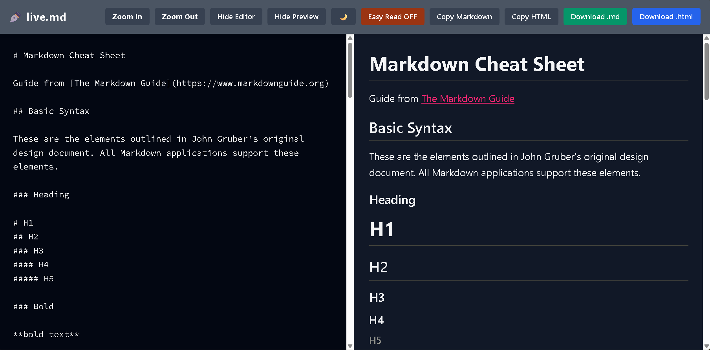
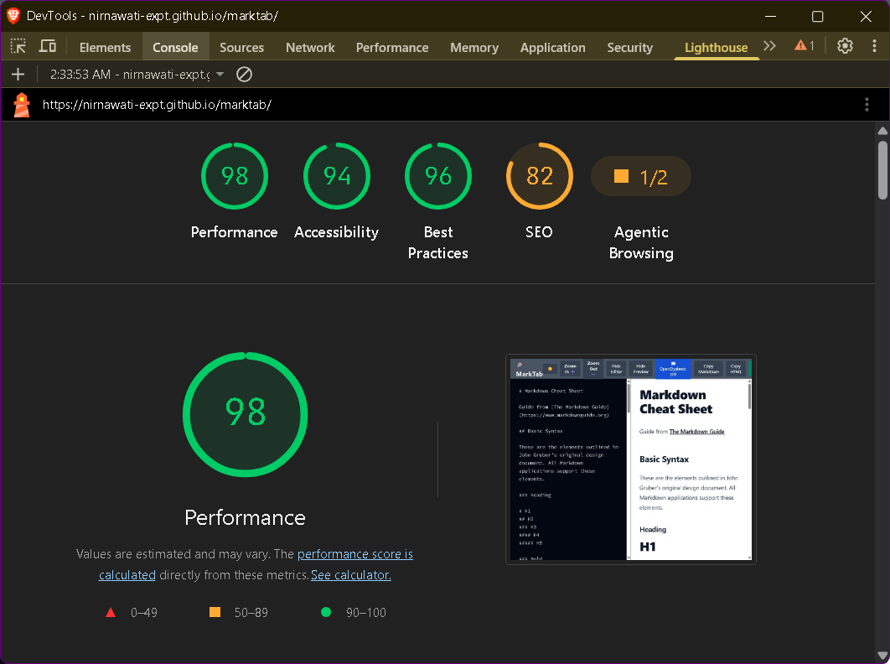
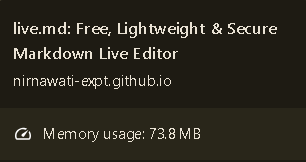

# live.md

An ultra-lightweight, 100% client-side Markdown editor and viewer. Built with plain HTML, Tailwind CSS, and pure JavaScript. No bundlers, frameworks, or npm. It's designed to be free, privacy-focused, and easy on low-spec laptops.

✒️ Try [live.md](https://nirnawati-expt.github.io/live.md/) Live. Free, lightweight, and secure markdown editor right in your browser.

| Light Mode | Dark Mode |
| :---: | :---: |
|  |  |

*Tip: You can easily toggle between these themes using the ☀️/🌙 button in the navigation bar.*

## Why This Exists

Most Markdown editors mean installing a heavy desktop app, fiddling with IDE extensions, or paying for a subscription. For people who live in the browser anyway, launching another resource hog just to take notes is wasteful, it clutters the desktop, drains battery, and adds friction.

**live.md** cuts through that. Keep it open in a browser tab instead. A new tab uses far fewer resources than an Electron app or IDE, and your workspace stays clean.

## Who It's For

- **Minimalists** who don't want a pile of apps on their desktop
- **Anyone on older hardware** who needs something light, not another memory hog
- **Browser-first workers** (students, remote staff) who want to stay in-browser and avoid context-switching
- **Privacy-conscious people** who can't afford cloud sync or tracking

## Stack

- **Tailwind CSS (via CDN)**: Styling and typography layout via `prose`.
- **HTML5 & Vanilla JavaScript**: Core logic and DOM manipulation.
- **Marked.js**: Lightweight client-side parser

## What It Does

- **Zero lag**, even on older machines
- **Pure vanilla code**, no heavyweight dependencies
- **Scroll sync** between editor and preview, in real-time
- **Focus mode**, hide either panel to go fullscreen
- **Dark and light themes**
- **One-click export** as Markdown or clean HTML
- **Works offline**, save as `.html` and run anywhere
- **100% private**, everything stays on your machine. No servers, no tracking

## Performance Highlights

### Blazing fast Performance
Achieves a **100% Lighthouse performance score**, fully optimized for accessibility and best practices despite using external utility frameworks.

### Ultra-low Memory Footprint

Runs seamlessly using only ~70 MB of RAM (validated via Chromium Task Manager).

### Instant Live Preview

Blazing-fast rendering powered by `marked.js` with smart input debouncing.

    
## License

- Software Code: Licensed under the [MIT](/LICENSE) License.
- Documentation & Content: The Markdown Cheat Sheet content is sourced from [Markdown Guide](https://www.markdownguide.org) and licensed under [CC BY-SA 4.0](https://creativecommons.org/licenses/by-sa/4.0/).